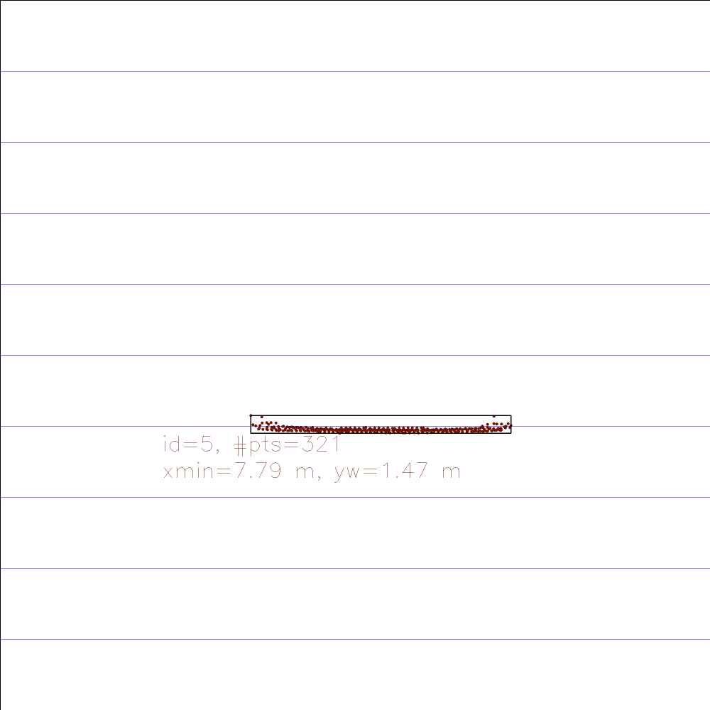
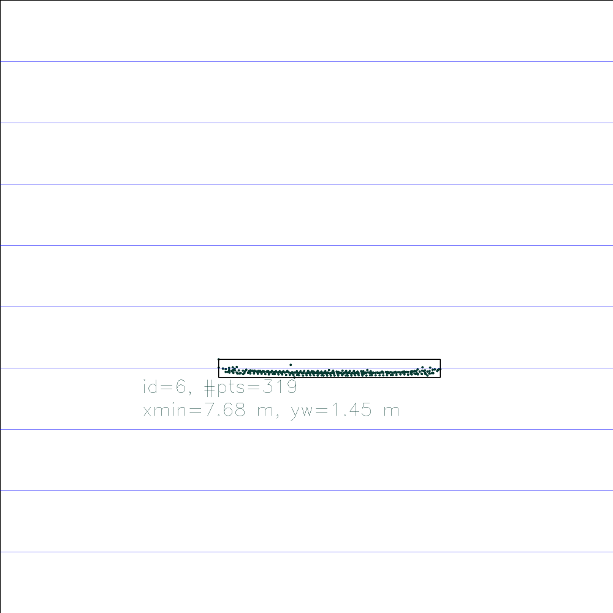
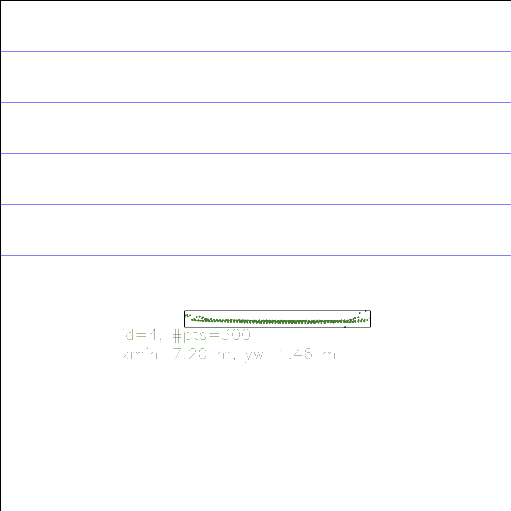
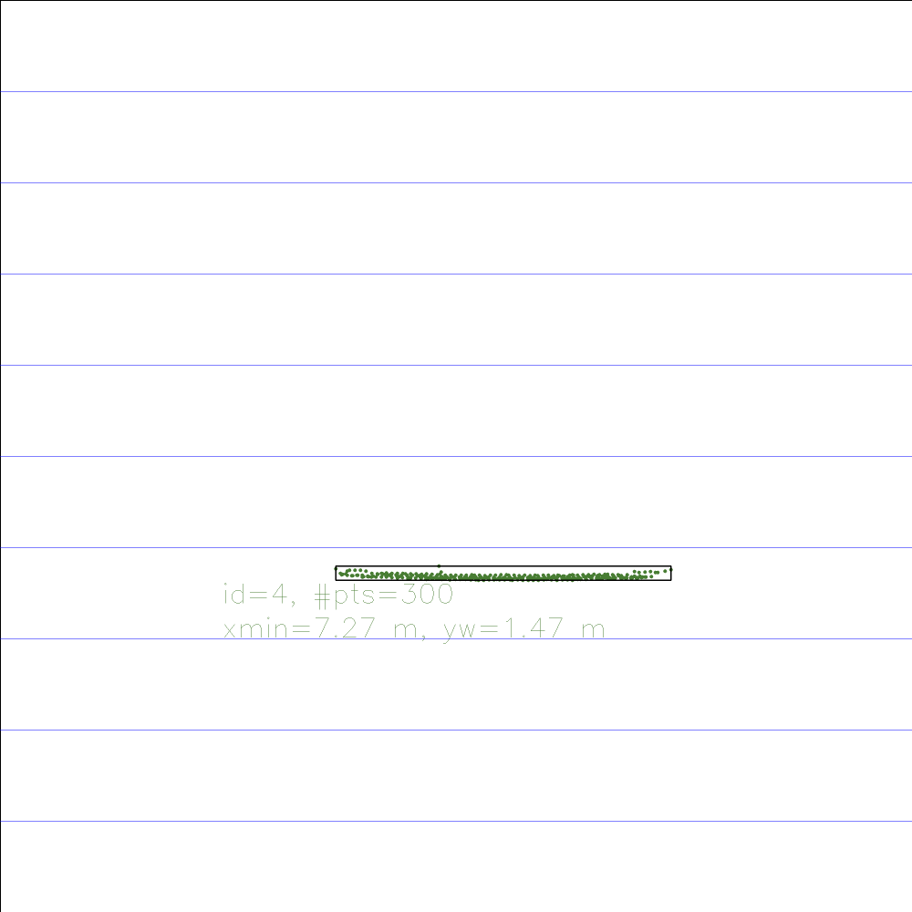

# Final project report: 3D object tracking

## FP.1 Match 3D Objects

The function *matchBoundingBoxes* matches each box in the *prevFrame* to the best match in the *currFrame*.
1. One by one, each box on the current frame is selected, and we loop through all the keypoint *matches*. 
2. If the previous box contains previous keypoint in match and current box contains current keypoint in matches, it increases the number of matches associated to the current box.
3. Then, it assigns the *currBox* with the highest number of matches to the *prevBox*. This process is repeated for every *prevBox* in *prevFrame*.

## FP.2 Compute Lidar-based TTC

The function *computeTTCLidar* takes the *lidarPoints* associated to the object in front in both the current and previous image to estimate the time to collision. 
1. It applies the *euclideanCluster* method (adapted from the Lidar SFND course) to pick the largest clusters in the current and previous image and reject outlier points. 
2. The median coordinates (along x) in previous and current cluster are picked.
3. The TTC is computed by dividing the distance from the closest point in current cluster to the estimated speed. This is calculated as the product of *frameRate* and difference between the *x* median coordinates in the previous and current clusters.

## FP.3 Associate Keypoint Correspondences with Bounding Boxes

The function *clusterKptMatchesWithROI* takes the current bounding box, the keypoints in the current and previous frame and the keypoint matches.
1. First we add all current keypoints contained in the bounding box.
2. It consider as potential matches belonging to the bounding box all those where current keypoint is contained in the bounding box. The distance between the position of the keypoints in the match is computed.
3. Only matches that have a distance between position in current and previous frame that is close enough to the median distance are added to the bounding box. The test is performed by checking if the error from the median is higher than 1.5 times the interquartile range.

## FP.4 Compute Camera-based TTC

The function *computeTTCCamera* takes the keypoints in the current and previous image along with the matches to compute the time to collision.
1. We get the distance of corresponding keypoints pair in the previous and current image, for each keypoint pair in both frames.
2. We check that the distance in the previous image is higher than an *epsilon* to avoid computing distance for coincident keypoints. A min distance is checked for keypoints in the current image.
3. We collect the distance ratio for each corresponding keypoint pair.
4. We compute the median distance ratio and compute the TTC using the frame rate and the median distance ratio to understand how close we have gotten to the object in front.

## FP.5 & FP.6 Performance Evaluation 

The time to collision computed on each pair of frames using the Lidar and the Camera with all the possible detector-descriptor pairs is reported in the spreadsheet under "outputs/ttc.ods".

It was extracted by calling the *objects3DTracking* function in the *FinalProject_Camera.cpp* for each descriptor-detector pair and saving the TTTc in the "outputs/ttc.csv" file. For the lidar TTC, we used the default pair SHITOMASI + BRISK.

We compute the median TTC computed with the camera methods to have a reliable estimates and we compare with the values computed by the Lidar to see which ones are far off.

The worst frame pair for overestimation of the TTC by the lidar are frames 4-5 (median camera TTC 14.7 s, lidar TTC 17.4 s).

The worst frame pair for underestimation of the TTC by the lidar are frames 12-13 (median camera TTC 11.9 s, TTC lidar 8.9 s).

Overall, the lidar estimates are always quite good thanks to the methods implemented in the camFusion_Student file that ensure robust TTC calculation.

